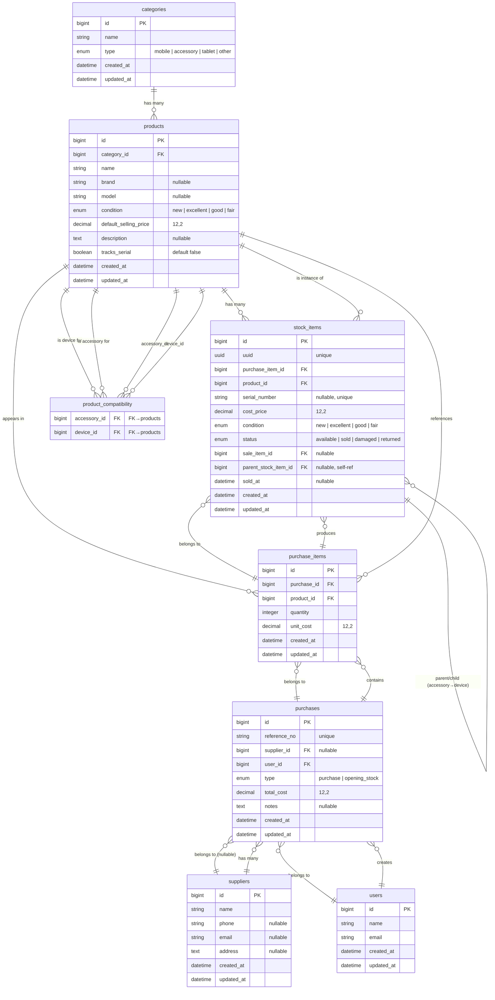

# ER Diagram — POS System

## Purchase Flow Summary

| Step | Action | Endpoint |
|---|---|---|
| 1 | Define categories | `POST /api/categories` |
| 2 | Define products | `POST /api/products` |
| 3 | Link compatibility | `POST /api/product-compatibility` |
| 4 | Define supplier | `POST /api/suppliers` |
| 5 | Create purchase (header + items) | `POST /api/purchases` |
| 6 | Stock items auto-generated | 1 row per unit |
| 7 | Sell individual items | `PATCH /api/stock-items/{id}/status` |

## Key Design Decisions

- **Individual unit tracking**: `stock_items` has one row per physical item, not quantity-based
- **Accessory linking**: At catalog level via `product_compatibility`; at unit level via `stock_items.parent_stock_item_id`
- **Opening stock**: Uses the same `purchases` flow with `type: opening_stock` and `supplier_id: null`
- **Serial/IMEI**: Optional; stored on `stock_items.serial_number` with unique constraint
